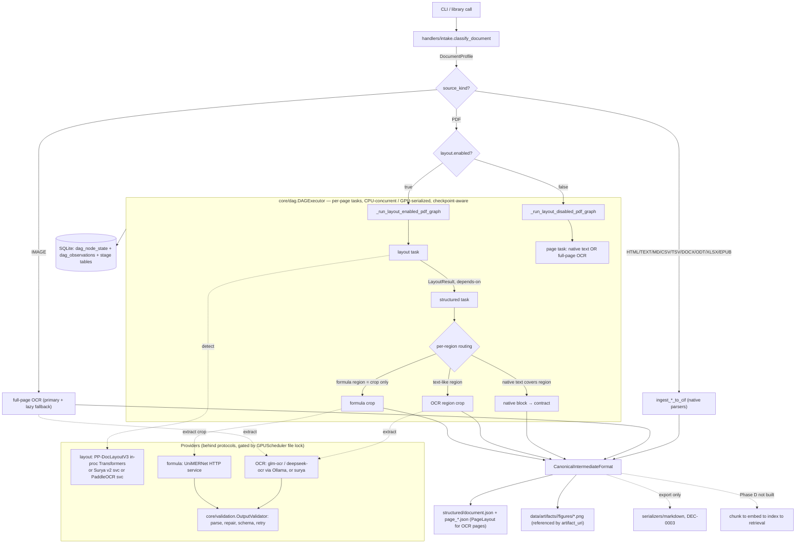

# ARCHITECTURE.md — How It's Built

> The **how**. Read before touching a component boundary, a data contract, or a
> stage interface. If a change alters anything here, update this file *before*
> writing the code, and record the change in `wiki/`.
>
> **Read by section, not whole.** Jump to the heading you need:
> System Overview · Data Flow · Components · Contracts · Technology Choices ·
> Boundaries · Failure Modes.
>
> Drawn from the codebase (`src/pocket_specialist/`), reconciled with the v0.5.1
> architecture spec. Intent and status live in SPEC.md; durable rationale in `wiki/`.

**Last reviewed:** 2026-06-19

---

## System Overview

A document enters through the **CLI** (or a library call), is classified by
**intake**, and is routed to one of three paths: a **native-ingest** path for
structured formats (HTML, text/markdown, CSV/TSV, DOCX/ODT, XLSX, EPUB) that
emits CIF directly; a **full-page OCR** path for images; or a **per-page
extraction DAG** for PDFs. The DAG schedules `layout` and `structured` tasks per
page, serializing GPU-heavy provider calls while keeping CPU work concurrent, and
checkpoints every node to SQLite so runs resume. All paths converge on the
**Canonical Intermediate Format (CIF)**, which is serialized to document-scoped
JSON. GPU-heavy providers (layout, OCR, formula) sit behind protocols; the
heavy/dependency-conflicting ones (Surya, PaddleOCR, UniMERNet) run as **isolated
HTTP services**. Markdown is an export layer only. Chunking, embedding, indexing,
and retrieval (Phase D) are not built — `retrieval/` is empty.

## Data Flow

> Edges carry typed values. `classify_document` decides the branch; PDFs run
> through the `DAGExecutor`; everything ends in CIF → `document.json` + checkpoints.



---

## Components

> One block per boundary. Boundaries are what drift erodes first.

### `cli.py` (entry surface)
- **Responsibility:** map commands to phase/compat functions; format terminal + benchmark output.
- **In/Out:** argv → calls `extract_structured_document` / `detect_layout_document` / compat / `serve-*`.
- **Owns:** command registration, provider-scoped output-dir selection, dev timing output.
- **Must not:** contain extraction logic or build prompts.

### `handlers/intake.py` (classification + native ingestion)
- **Responsibility:** classify a source (`SourceKind`, `PdfContentType`, MIME) and ingest non-PDF formats straight to CIF; extract native PDF text blocks scaled into render space (RUL-0005).
- **In/Out:** `Path` → `DocumentProfile`; native sources → `CanonicalIntermediateFormat`.
- **Owns:** `classify_document`, `detect_mime_type`, `ingest_*_to_cif`, `get_pdf_native_blocks`, `_table_block` normalization.
- **Must not:** call GPU providers; emit markdown.

### `layout/` (first-class layout subsystem)
- **Responsibility:** detect regions (bbox, confidence, reading order, polygon) behind `LayoutProvider`.
- **In/Out:** `image_bytes` → `LayoutResult`. Adapters: `PPDocLayoutV3LayoutProvider` (in-process Transformers), `SuryaLayoutServiceProvider`, `PaddleOCRLayoutServiceProvider` (HTTP). `compare.py` renders side-by-side bundles.
- **Owns:** label normalization (`_LAYOUT_LABEL_MAP`), region typing, the HTTP service client; `service.py`/`paddle_service.py` are the isolated servers.
- **Must not:** be imported in-process for the Surya/Paddle runtimes (DEC-0005/0006); reorder by geometry (DEC-0013).

### `ocr/providers.py`
- **Responsibility:** OCR behind `OCRProvider`; own the prompts.
- **In/Out:** `(image_bytes, region_type)` → validated `OCRResult`. `OCR_PROVIDERS = {glm-ocr, deepseek-ocr, surya}`; primary/fallback built from config.
- **Owns:** prompt construction, `_validate_ocr_payload`, retry/escalation + batch-split recovery.
- **Must not:** let prompt strings leak upward; `sys.exit` on missing deps (RUL-0002).

### `formula/`
- **Responsibility:** formula extraction isolated from OCR via `FormulaExtractor`.
- **In/Out:** crop bytes → `FormulaResult` (or `FormulaFallback`). `UniMERNetFormulaExtractor` is an HTTP client; `symbolic.py` is the OCR-fallback path; `service.py` is the isolated server.
- **Owns:** UniMERNet client, formula payload validation, symbolic recovery.
- **Must not:** infer formula semantics from native/OCR text (DEC-0007); emit a provider label outside `{unimernet, ocr-fallback}` (RUL-0003).

### `phases/extract.py` (orchestration)
- **Responsibility:** the routing brain — classify → branch → build per-page DAG → route regions → assemble CIF → write outputs.
- **In/Out:** `Path` → `(done, failed, CIF)`. Builds `ExtractionTask`/`PageUnit` graphs, wires `runner`/`resume` for `DAGExecutor`, writes `layout/`, `structured/`, figure artifacts, dev checkpoints.
- **Owns:** region overlap matching, native/OCR/formula contract builders, `PageLayout` vs structured-page writers (CON-0003), aggregate `document.json` assembly.
- **Must not:** import provider runtimes directly beyond the `build_*` factories; treat a native-text page as complete (RUL-0004).

### `core/` (shared kernel)
- **`dag.py` — `DAGExecutor`:** thread-pool scheduler; dependency edges, per-resource semaphores (CPU concurrent / layout·ocr·formula serialized), checkpoint-aware skip + artifact-validated resume (DEC-0009).
- **`gpu.py` — `GPUScheduler`:** cross-process `fcntl.flock` arbitration; `claim()`/`acquire()`; `empty_cache` on release (DEC-0004/0008).
- **`validation.py` — `OutputValidator`:** strict parse / repair / schema / issues (`OutputValidationError`).
- **`cif.py` + `models.py`:** CIF dataclasses + legacy `BlockType` enum/adapters.
- **`tasks.py`:** `ExtractionTask` + `ProcessingUnit` hierarchy.
- **`config.py`:** typed `PipelineSettings` (sections below) + repo-root resolution.

### `storage/checkpoint.py`
- **Responsibility:** SQLite state + DAG observation store.
- **Owns:** `dag_node_state`, `dag_observations`, legacy stage tables; `set_status` mirrors stage→node; resume/summaries.
- **Must not:** become the inter-stage data channel — it stores status + artifact paths, not CIF payloads.

### Isolated services (out-of-process, CON-0002)
- `layout/service.py` (Surya v2), `layout/paddle_service.py` (PaddleOCR), `formula/service.py` (UniMERNet). Each: `POST /load`, `POST /detect`|`/extract`, `POST /offload`, `GET /health`, own venv under `services/`.

### `serializers/markdown.py` + `compat/` + `retrieval/`
- `serializers/markdown.py`: on-demand export only (DEC-0003). `compat/`: legacy render→ocr→equations→correct→assemble markdown flow (Known Debt). `retrieval/`: **empty package — Phase D placeholder.**

---

## Contracts / Interfaces

> Changing one of these is a decision-worthy event. Shapes are the real ones in code.

**Intake**
```python
DocumentProfile{ doc_id, source_path, source_kind: SourceKind, mime_type,
                 page_count, text_extractable, pdf_content_type: PdfContentType }
SourceKind = pdf|html|text|markdown|image|csv|tsv|docx|odt|xlsx|epub
PdfContentType = digital|scanned|hybrid|none
```

**Provider protocols**
```python
LayoutProvider:   load(); detect(image_bytes)->LayoutResult; offload()
OCRProvider:      load(); extract(image_bytes, region_type)->OCRResult;
                  extract_batch(units)->list[OCRResult]; offload(); health_check()->bool
FormulaExtractor: load(); extract(image_bytes)->FormulaResult;
                  extract_batch(crops)->list[FormulaResult]; offload()
ExtractionMode = REGION_GUIDED (primary) | PAGE_STRUCTURED (degraded)
```

**Provider results**
```python
LayoutRegion{ region_id, region_type, bbox:(x0,y0,x1,y1), confidence,
              reading_order, polygon?, metadata }
LayoutResult{ page_id, regions:[LayoutRegion], layout_confidence? }
OCRResult{ region_type, typed_content:dict, provider, confidence?,
           structure_confidence?, bounding_boxes?, raw_response, latency_ms, extraction_metadata }
FormulaResult{ latex, mathml?, provider, confidence?, is_inline, raw_response, latency_ms }
```

**CIF (inter-stage state — the only thing that crosses stage boundaries; RUL-0001)**
```python
SourceCoords{ page?, bbox?, polygons? }
ProvenanceRecord{ source_stage, provider?, confidence?, lineage:[str], metadata }
ProcessingArtifact{ artifact_id, artifact_type, uri, metadata }   # figure binaries are external
StructuredBlock{ block_id, doc_id, block_type:str, content:dict, section_path:[str],
                 reading_order, page?, source_coords?, provenance }
CanonicalIntermediateFormat{ doc_id, blocks:[StructuredBlock], artifacts:[ProcessingArtifact], metadata }
```

**Structured output payload `type`s (spec §12, carried as `block_type` strings):**
`TextBlock · TableBlock(headers,rows[,schema|sheet_name]) · CodeBlock · KeyValueBlock ·
FigureBlock(artifact_uri) · FormulaBlock(provider∈{unimernet,ocr-fallback}) · FormulaFallback`.
Per-page OCR pages persist as `PageLayout{ type, blocks, reading_order }` (CON-0003).

**Execution + checkpoint**
```python
ExtractionTask{ task_id, task_type, dependencies:[str], input_refs:[str],
                resource_requirements:dict, retry_count }
ProcessingUnit ⊳ PageUnit | RegionUnit | FormulaUnit | TextSectionUnit | RowBatchUnit
DAGExecutor.run(document, tasks, units, runner: TaskRunner, resume: CheckpointResumeHandler?)
            -> GraphExecutionResult{ completed, failed, skipped, blocked }
TaskRunner(task, unit) -> TaskRunResult{ path?, metadata }
DAGNodeState{ document, page, node, status, attempts, path, metadata, error, timestamps }
# tables: dag_node_state (latest per document,page,node) ; dag_observations (append-only)
```

**HTTP service contract:** `detect`/`extract` request `{"image": base64}` → `{page_id,
regions:[...], layout_confidence}` (layout) / formula result JSON. `load`/`offload`/`health`.

**Public phase API**
```python
extract_structured_document(source_path, structured_output_dir?, layout_output_dir?,
                            layout_provider_name?) -> (done:int, failed:int, CIF)
detect_layout_document(source_path, layout_output_dir?, layout_provider_name?)
                            -> (done:int, failed:int, {page:int -> LayoutResult})   # PDF only
```

---

## Technology Choices

| Concern | Choice | Status | Rationale |
|---------|--------|--------|-----------|
| Inter-stage state | Typed CIF, no raw dicts | locked | DEC-0001 / RUL-0001 |
| Orchestration | In-process thread-pool DAG executor | locked | DEC-0009 |
| GPU arbitration | `fcntl.flock` cross-process file lock | locked | DEC-0004 / DEC-0008 |
| Default layout | PP-DocLayoutV3 via Transformers (in-proc) | locked | DEC-0006 |
| Heavy providers | Out-of-process HTTP microservices | locked | DEC-0005 / CON-0002 |
| OCR runtime | glm-ocr / deepseek-ocr (Ollama) + surya | provisional | spec §6 |
| Formula | UniMERNet isolated service; crop-only routing | locked | DEC-0007 / spec §8 |
| State store | SQLite (stage tables + DAG observations) | locked | DEC-0010 |
| PDF rendering | PyMuPDF, DPI-capped (`rendering.max_dpi`) | provisional | spec §17 |
| Export | Markdown on demand only | locked | DEC-0003 |
| Vector store / embedding | ChromaDB / `nomic-embed-text` | **config only, NOT wired** | spec §14 — Phase D |

`config.py` sections (typed): `rendering · ocr · layout · formula · embedding · gpu ·
chunking · batch · storage · runtime`. `embedding`/`chunking` exist but are unused.

## Boundaries & Invariants

- **CIF is the only inter-stage channel.** No raw dicts across boundaries (RUL-0001);
  markdown is export-only and never read back as state (DEC-0003).
- **Providers are swappable behind protocols;** heavy/conflicting runtimes are
  out-of-process and never imported by the main runtime (DEC-0005). PP-DocLayout
  is the in-process exception, Transformers-only (DEC-0006).
- **GPU-heavy sections serialize across processes** via the file lock; CPU graph
  work stays concurrent (DEC-0004/0008). Offload runs in `finally`/cleanup paths.
- **Layout `formula` regions are crop-only** routing hints (DEC-0007); native text
  satisfies only the regions it covers (RUL-0004); native PDF coords are scaled
  into render space before matching (RUL-0005).
- **Provider/runtime failures raise**, never `sys.exit` (RUL-0002).
- **DAG resume validates artifacts** before trusting a `done` node; stale/missing
  artifacts force rerun; no stage mutates another stage's output in place (DEC-0009).
- **Figure binaries are external** (`artifact_uri`); CIF never inlines binaries.

## Failure Modes

- **Malformed OCR JSON →** first pass rejects repair; constrained-prompt retry (repair
  allowed only here); then fallback provider (spec §7.3).
- **Timeout / CUDA OOM →** `extract_batch` splits the batch recursively to a single
  unit; `empty_cache()` + halve on OOM.
- **Provider unavailable →** route to fallback provider; **import/init failure →**
  `RuntimeError` with install guidance, process survives (RUL-0002).
- **Formula extraction fails →** OCR symbolic recovery (`ocr-fallback`) if text looks
  symbolic, else explicit `FormulaFallback` — lineage preserved (RUL-0003).
- **Service cold start** can exceed the 60s client `detect` timeout (Surya vLLM
  observed ~294s). Pre-warm or raise the timeout — known operational caveat.
- **GPU lock contention →** `TimeoutError` after `runtime.gpu_serialization_timeout_s`.
- **Known open bugs (see SPEC Success Criteria):** a no-op rerun can overwrite
  `structured/document.json` with an empty CIF (aggregate not rebuilt from per-page
  artifacts); `glm-ocr` can echo the prompt placeholder and pass JSON-shape
  validation (shape ≠ semantic validation, DEC-0012).
