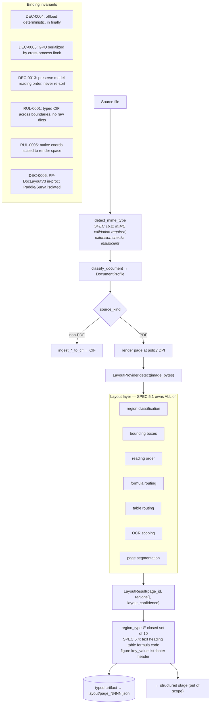
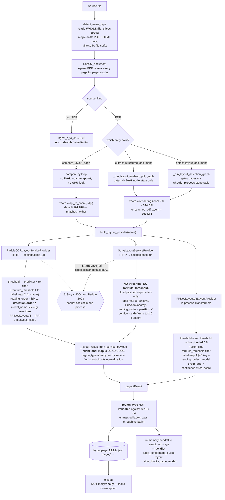

# Layout Path Review — Implementation vs Expected

**Scope:** every code path from document intake up to and including layout
detection. Everything after layout (region routing, OCR, formula, CIF assembly)
is out of scope except where it constrains the layout contract.

**Purpose:** establish clear, equal test conditions before running the
provider comparison that DEC-XXXX (layout standardization) will rest on.

**Date:** 2026-08-14 · **Branch:** `fix/pp-doclayout`

---

## 1. Expected flow (SPEC §3 / §5 + ARCHITECTURE contracts)

**Key expectation:** all three providers are interchangeable implementations of
one protocol producing one comparable `LayoutResult`. Swapping the provider
should change *only* the model, not the measurement.

---

## 2. Actual flow (as implemented)

---

## 3. Divergence table

| # | Expected | Actual | Where | Severity |
|---|---|---|---|---|
| **C1** | Each isolated service addressable independently | One `base_url` scalar shared by Surya + Paddle providers | `config.py:172`, `providers.py:307,368` | **Blocker** |
| **C2** | Identical detection threshold across providers | PP=0.5 hardcoded fallback; Paddle=config or PaddleX default; Surya=**none** | `providers.py:228`, `paddle_service.py:172-192`, `service.py:172-207` | **Blocker** |
| **C3** | One label taxonomy | Three maps; client map unreachable for services | `providers.py:44,450`, `service.py:30`, `paddle_service.py:36` | **Blocker** |
| **C4** | `reading_order` = model reading order (DEC-0013) | Paddle emits `idx-1` detection order | `paddle_service.py:204` | **High** |
| **C5** | Benchmark at production operating point | Compare defaults 192 DPI; pipeline uses 144 / 300 | `cli.py:263`, `config.py:150-151` | **High** |
| **C6** | `layout_confidence` comparable | Surya defaults missing confidence to `1.0`, inflating the mean | `service.py:192` | **High** |
| **C7** | Offload deterministic, in `finally` (DEC-0004) | Offload after `executor.run()`, outside any `try` | `extract.py:1496-1510,1591-1593` | **High** |
| **C8** | `region_type` ∈ closed set of 10 (SPEC §5.4) | Unmapped labels pass through unvalidated | all three `normalize_layout_label` | Medium |
| **C9** | One resume mechanism per stage | `should_process` stage table vs DAG node state | `extract.py:1523` vs `1300-1327` | Medium |
| **C10** | Service client timeout ≥ cold start | `_LAYOUT_SERVICE_TIMEOUT_SECONDS = 60` vs 417 s observed (RUL-0006) | `providers.py:84` | Medium |
| **C11** | MIME validated, not extension-sniffed (SPEC §16.2) | Magic bytes for PDF/HTML only; rest by suffix; no size caps | `intake.py:257-289` | Medium |
| **C12** | Typed CIF across stage boundaries (RUL-0001) | layout→structured in-memory handoff is a raw dict | `extract.py:1366-1372` | Low (judgment) |
| **C13** | Config declares what runs | Paddle silently rewrites `PP-DocLayoutV3` → `PP-DocLayout_plus-L` | `paddle_service.py:88-89` | Low |
| **C14** | Symmetric availability check | Only services have `health_check`; PP can never report "unavailable" | `compare.py:107` | Low |
| **C15** | Efficient intake | `read_bytes()[:1024]` loads whole file; `classify` + render + native re-open PDF `1+2N` times | `intake.py:258,322,356,364` | Low |

---

## 4. What this means for the pending decision

The three numbers recorded in `STATE.md` — PP 55 regions / Paddle 51 / Surya 26,
confidences 0.81 / 0.86 / — — **are not measurements of the same quantity.**

- Surya's 26 is **unfiltered** (no threshold applied anywhere in its path).
- PP's 55 is filtered at a **hardcoded 0.5**.
- Paddle's 51 is filtered at whatever `layout.threshold` was set to, or the
  PaddleX default if unset — and against a **different model** than the config names.
- Surya's mean confidence is computed over values that **default to 1.0**.
- Surya counts `text_inline_math` and `chemicalblock` as `formula`; PP has no
  equivalent mapping. The 6–7× formula-count gap is partly a **taxonomy artifact**,
  not a model-quality signal.

No layout DEC should be recorded on this evidence.

---

## 5. Ordered fix list to reach comparable conditions

1. **C1** — per-provider base URL (`layout.surya_base_url` / `layout.paddle_base_url`,
   or a `base_urls` map keyed by provider). Unblocks single-run multi-provider comparison.
2. **C2 + C6** — one explicit threshold policy applied at one place. Either push
   the threshold into all three services, or (simpler) capture raw regions with
   **no** filtering and apply a single client-side threshold sweep at analysis time.
   The latter also gives precision/recall curves instead of one arbitrary operating point.
3. **C3** — collapse to a single shared label map. Services should emit their
   **raw** `provider_label` and let the client normalize once; delete the two
   service-side maps.
4. **C5** — comparison DPI defaults to the production value, with the operating
   point recorded in `summary.json`.
5. **C4** — Paddle must emit real reading order or explicitly declare it absent
   (`reading_order: null`) rather than fabricating enumeration order.
6. **C7** — wrap provider offload in `try/finally` at both graph sites.
7. **C10** — raise the service timeout, or split `/load` (long) from `/detect` (short).
8. **C8** — validate `region_type` against the SPEC §5.4 closed set; log or reject
   out-of-set labels instead of silently passing them through.

Items 1–4 are prerequisites for a decision-grade comparison. 5–8 are correctness
work that can land alongside.

---

## 6. What conforms (no action)

- `LayoutRegion` / `LayoutResult` match SPEC §5.3 exactly, plus additive
  `polygon` / `metadata`. Typed dataclasses throughout.
- Layout JSON artifacts are typed and round-trip via `_layout_result_from_payload`.
- GPU serialization: services claim the flock **inside** the service process
  (`service.py:177`, `paddle_service.py:179`) — correct cross-process arbitration
  per DEC-0008. In-process PP claims in `detect()`.
- DEC-0006 holds: no PaddleOCR or Surya runtime is imported in the main process;
  both are reached only over HTTP.
- DEC-0013 holds for PP (`order_seq` preserved) and Surya (`position` preserved).
- RUL-0005 holds: `get_pdf_native_blocks` scales native coords by the same
  `zoom_factor` used for rendering.
- RUL-0002 holds: all provider import/init failures raise `RuntimeError` with
  install guidance.
- DAG layout tasks correctly declare `resource="layout"` with semaphore capacity 1.
